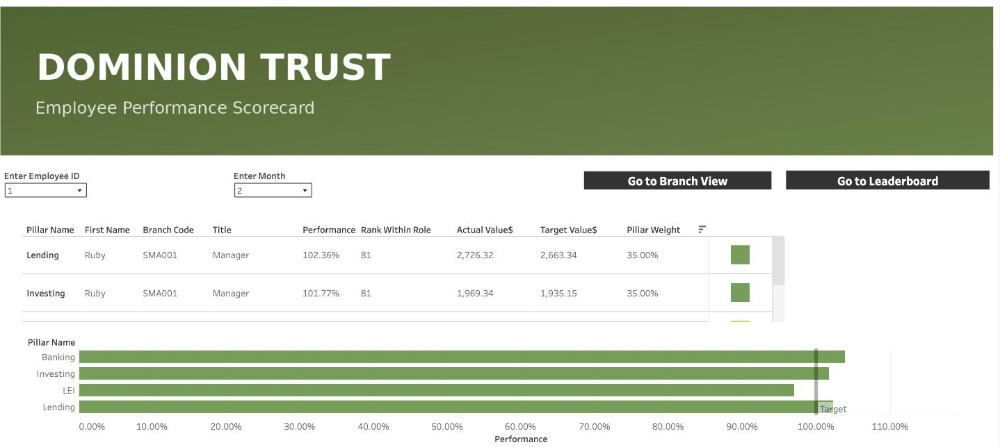
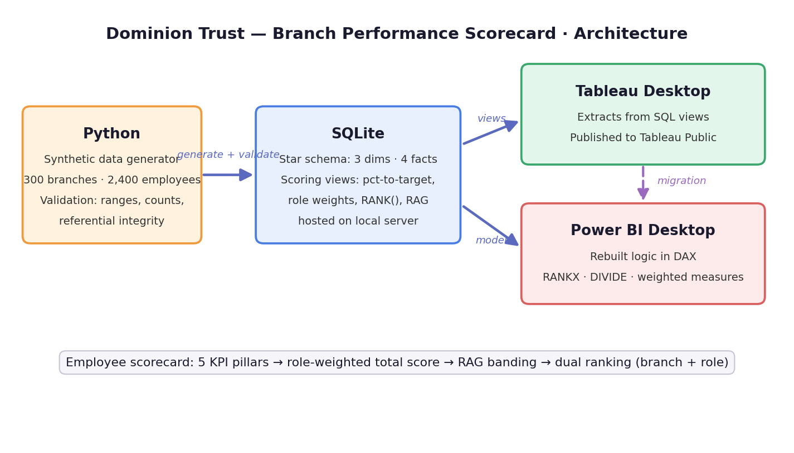
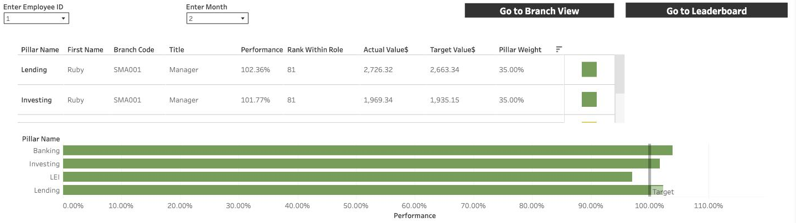
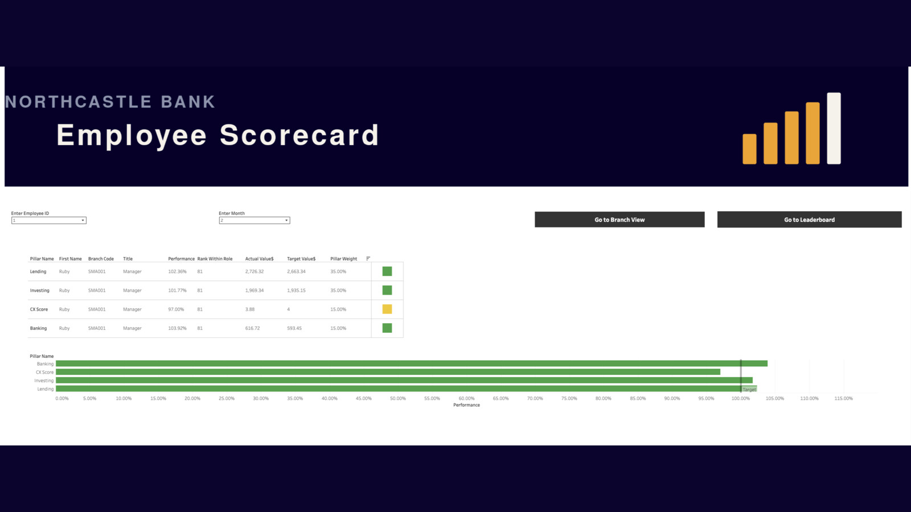
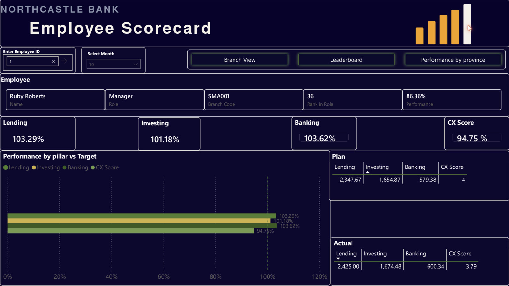
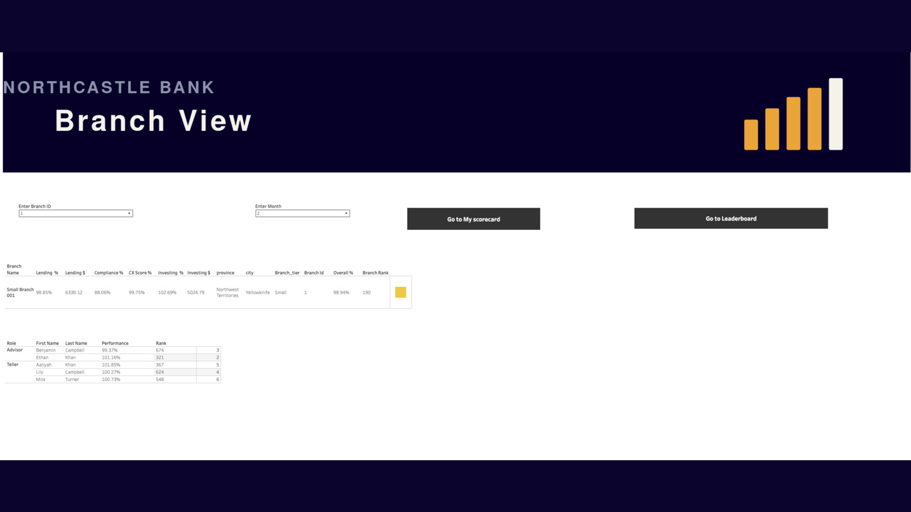
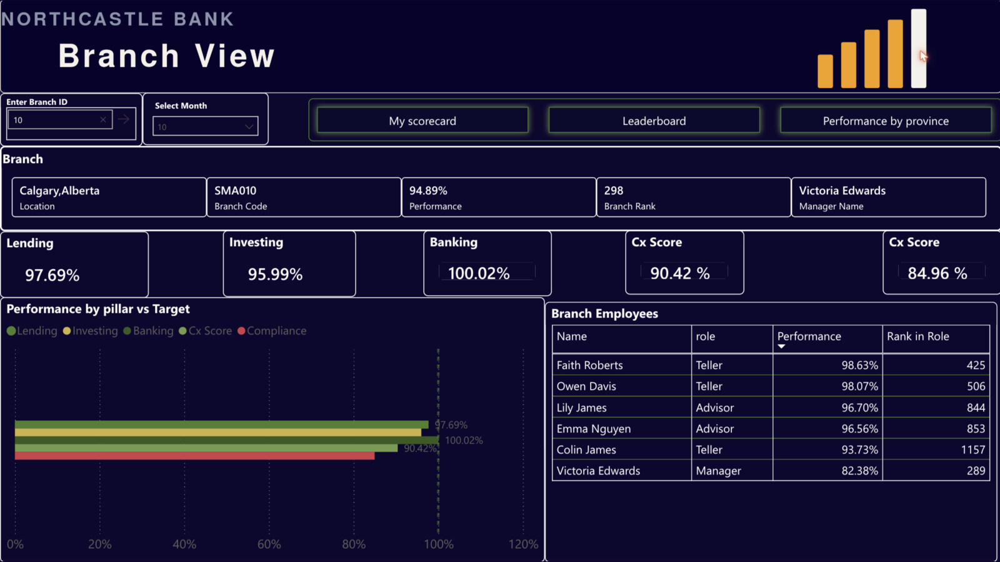
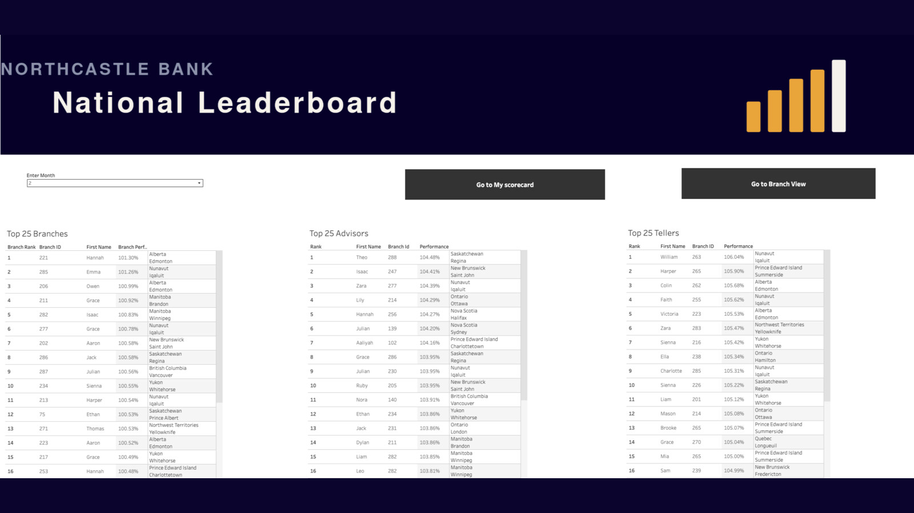
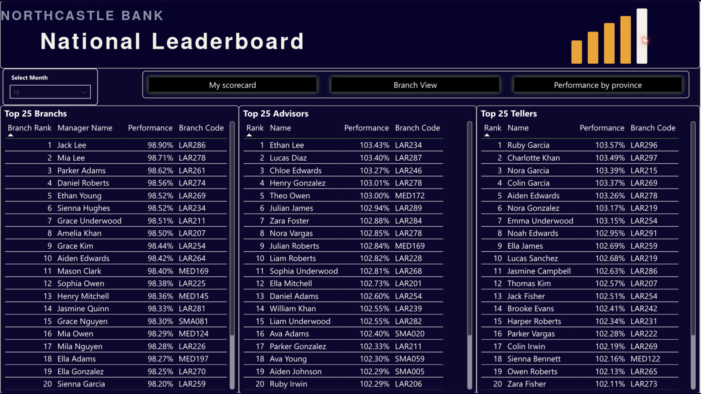
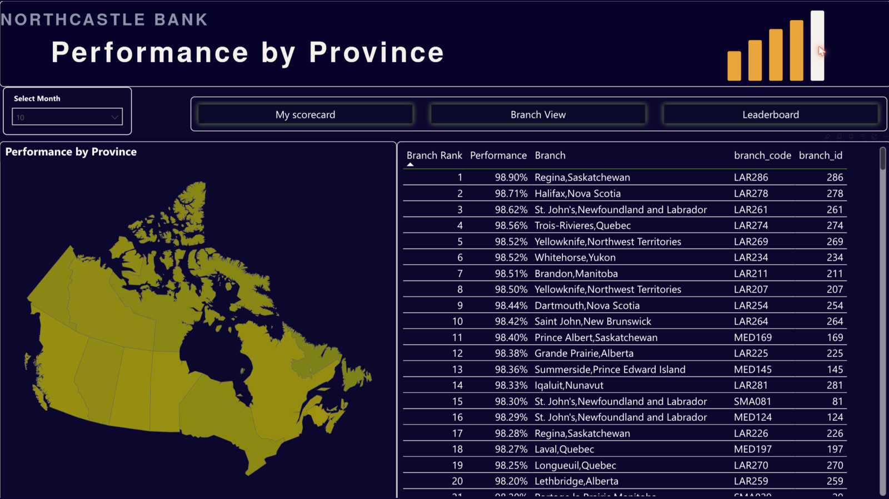

# Northcastle Bank — Branch Performance Scorecard

**An end-to-end BI project: SQL data model → Tableau dashboard → Power BI migration**

A performance scorecard for a fictional Canadian bank (Northcastle Bank) covering **300 branches** and **2,400 employees** across three roles — Manager, Advisor, and Teller. The scorecard tracks monthly performance against targets, combines five KPI pillars into a single role-weighted score, applies RAG (Red/Amber/Green) status banding, and ranks employees and branches in multiple contexts.

🔗 **[Live Tableau dashboard on Tableau Public](https://public.tableau.com/app/profile/ven.anusuri/viz/DominionTrustBankScorecard/MyScorecard)**



Built first in Tableau, then rebuilt in Power BI to compare the two architectures and translate the SQL/Tableau logic into DAX.

---

## Why this project

I spent years on the front line of financial services being measured *by* scorecards like this — a weighted score, a rank, a colour next to my name — without ever knowing how the numbers worked. This project is me crossing to the other side of the dashboard and rebuilding that entire system from the data model up.

That user's-eye view drove the design: fair like-for-like rankings, no scoring people on metrics they can't influence, and every number traceable to a transparent SQL view. The result reproduces real scorecard complexity end to end — data generation, modeling, validation, visualization, and a full platform migration.

## Architecture



- **Data layer** — star schema in SQLite: 3 dimension tables, 4 fact tables, ~90K fact rows covering 12 months. All scoring, ranking, and RAG logic lives in SQL views so both BI tools consume identical, pre-validated numbers.
- **Python** — generated the synthetic data (realistic distributions per role/branch tier) and ran validation checks (row counts, referential integrity, target ranges).
- **BI layer** — Tableau consumed the SQL views via extracts; Power BI rebuilt the same logic natively in DAX.

## Data model

| Table | Rows | Grain |
|---|---|---|
| `dim_branch` | 300 | One row per branch (tier, province, city, headcount) |
| `dim_employee` | 2,400 | One row per employee (role, branch, hire date) |
| `dim_role_weights` | 11 | One row per role × pillar weight |
| `fact_sales` | 28,800 | Employee × month actuals (Lending, Investing, Banking Units, CX Score) |
| `fact_targets` | 28,800 | Employee × month targets (incl. compliance target) |
| `fact_lei_survey` | 28,800 | Employee × month customer-survey detail |
| `fact_compliance` | 3,600 | Branch × month compliance & risk scores |

SQL views (`sql/02_views.sql`) layer the logic: `vw_employee_monthly_score` → `vw_employee_rank`, and `vw_branch_monthly_score` → `vw_branch_pacing`.

## Metric structure

### Five performance pillars

1. **Lending** — loan production vs. target
2. **Investing** — investment sales vs. target
3. **Banking Units** — core banking product volume vs. target
4. **CX Score** — customer experience score (survey-based)
5. **Compliance / Risk** — branch-level compliance score (manager accountability only)

### Role-based weighting

Each role is measured only on the pillars it can influence, with role-specific weights:

| Pillar | Manager | Advisor | Teller |
|---|---:|---:|---:|
| Lending | 30% | 35% | — |
| Investing | 30% | 35% | — |
| Banking Units | 15% | 15% | 70% |
| CX Score (customer experience) | 10% | 15% | 30% |
| Compliance / Risk | 15% | — | — |

Advisors and Tellers are excluded from the Compliance pillar — it is a manager-level accountability. Tellers are not measured on Lending or Investing.

### Scoring formula

For each pillar: **pillar score = actual ÷ target** ("percent to target").

These are combined into a single number per employee per month:

```
Weighted Total Score = Σ (pillar_pct_to_target × role_weight) / 100
```

Non-applicable pillars are excluded from a role's calculation rather than zero-filled into the denominator. In the Power BI rebuild, division is null-safe via `DIVIDE`.

### RAG status banding

| Band | Threshold |
|---|---|
| 🟢 Green | Weighted score ≥ 100% of target |
| 🟡 Amber | ≥ 90% |
| 🔴 Red | < 90% |

### The scorecard in action

Employee view: pillar-by-pillar percent to target with pillar weights, rank within role, and performance vs. target — navigable to Branch View and company-wide Leaderboard.



### Two ranking contexts

Rankings are computed with window functions (`RANK() OVER (PARTITION BY …)`):

- **Employees** are ranked twice: within their **branch** (vs. their local team) and within their **role company-wide** (Advisor vs. all 300 branches' Advisors — a fair like-for-like comparison).
- **Branches** are ranked company-wide by their weighted score using **Manager weights**, since the Manager's weight profile represents full branch accountability including compliance.

## Problems encountered & solved

**1. Out-of-spec target data (caught in validation, fixed at the source).**
A target field in the synthetic data generator was producing values outside its intended spec. Rather than patching it downstream with filters or capped calculations, I traced it back through the pipeline to the generation logic and fixed it at the source — then re-ran validation to confirm every target landed in range. Downstream patches hide bugs; source fixes remove them.

**2. Tableau workbook corruption (XML surgery).**
An abandoned Tableau extension left broken references in the workbook's underlying XML, and the workbook would no longer open. I recovered it by inspecting the `.twb` XML directly, locating and removing the orphaned extension nodes, and validating the repaired file. Lesson: a `.twb` is just XML — knowing that turns a "corrupted, start over" situation into a 20-minute fix.

**3. Fan-out from incorrect table relationships.**
Relating fact tables to each other directly (e.g., sales-to-targets at mismatched grain) caused row duplication — a classic many-to-many fan-out that silently inflated totals. I diagnosed it by reconciling aggregates against known SQL totals, then removed the direct relationships and replaced them with calculated/lookup logic so each measure resolves at the correct grain. Validating BI totals against the database is the fastest way to catch fan-out.

## Migration notes: SQL → DAX

The Power BI rebuild translated the SQL view logic into native DAX measures:

| Concept | SQL (SQLite views) | DAX (Power BI) |
|---|---|---|
| Ranking | `RANK() OVER (PARTITION BY role, month)` | `RANKX(ALLEXCEPT(...), [Weighted Score])` |
| Weighted score | `SUM(pct_to_target × weight_pct) / 100` in view | Weighted measure composed from pillar measures |
| Safe division | `actual / NULLIF(target, 0)` | `DIVIDE(actual, target)` |
| Role exclusions | `CASE WHEN role = 'Teller' THEN NULL …` | Conditional measure logic / `TREATAS` on weights |

Key architectural difference: SQL pre-computes results at fixed grain in views; DAX computes at query time against the filter context, so ranking context ("within branch" vs. "within role") shifts from `PARTITION BY` clauses to `ALLEXCEPT`/`ALLSELECTED` filter manipulation.

📄 Full details: **[docs/migration_notes.md](docs/migration_notes.md)**

## The migration, side by side

The same scorecard, rebuilt page-for-page in both tools — same data, same scoring logic, two different engines.

### Employee Scorecard

| Tableau | Power BI |
|---|---|
|  |  |

### Branch View

| Tableau | Power BI |
|---|---|
|  |  |

### National Leaderboard

| Tableau | Power BI |
|---|---|
|  |  |

### Performance by Province (Power BI)

Added during the Power BI rebuild — a map view ranking branches geographically:



## Repository structure

```
├── README.md
├── assets/                # Architecture diagram + dashboard screenshots
├── data/                  # CSV extracts of all tables
│   ├── dim_branch.csv
│   ├── dim_employee.csv
│   ├── dim_role_weights.csv
│   ├── fact_sales.csv
│   ├── fact_targets.csv
│   ├── fact_lei_survey.csv
│   └── fact_compliance.csv
├── db/
│   └── scorecard.db       # SQLite database (tables + views)
├── python/
│   ├── generate_branch_sales_scorecard.py   # Synthetic data generator (seeded)
│   └── build_scorecard_sql.py               # Loads CSVs into SQLite + builds views
├── sql/
│   ├── 01_schema.sql      # Table DDL
│   └── 02_views.sql       # Scoring, ranking & RAG views
├── tableau/
│   └── dominion_trust_scorecard.twb   # Production Tableau workbook
├── powerbi/
│   └── dominion_trust_scorecard.pbix  # Power BI rebuild (DAX)
└── docs/
    ├── data_dictionary.md
    └── migration_notes.md   # Tableau → Power BI migration log
```

## Roadmap

This is an actively developed project:

- [x] SQL data model, scoring views, validation
- [x] Tableau dashboard (published to Tableau Public)
- [x] Power BI data model + DAX measures
- [x] Power BI report published (.pbix in `powerbi/`)
- [x] Visual architecture diagram
- [x] Tableau dashboard screenshots in README
- [x] Power BI dashboard screenshots in README
- [x] Side-by-side Tableau vs. Power BI comparison
- [x] Python data-generation scripts published (`python/`)

## Tech stack

SQLite · Python · Tableau Desktop · Power BI Desktop · DAX

---

*All data is synthetic. Northcastle Bank is a fictional bank created for portfolio purposes.*
